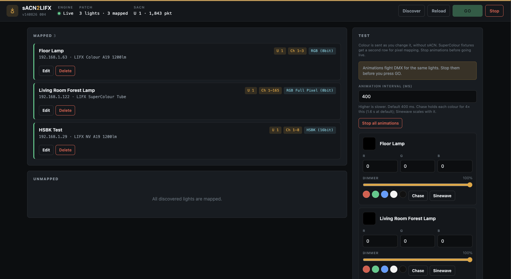

# sACN2HomeLX

Control LIFX and Nanoleaf lights via sACN/E1.31 with automatic discovery and a web-based mapping interface.



## Features

- **Automatic LIFX Discovery**: Automatically discovers all LIFX lights on your network using the LIFX LAN protocol
- **Nanoleaf Open API**: Discovers and pairs panel controllers on the LAN, then maps the whole fixture or individual panels. See [Nanoleaf](#nanoleaf) for supported products and pairing.
- **Web UI**: Clean, intuitive web interface for mapping lights to DMX universes and channels
- **Rename Lights**: Give mapped lights a custom name in the UI; the name is stored in `config.json` and does not change the bulb's LIFX label
- **E1.31/sACN Support**: Receives DMX via sACN multicast (`239.255.x.x`) and unicast, with real-time universe and packet status
- **Test RGB Mode**: Test lights directly without DMX input - useful for debugging and verification
- **Network Interface Selection**: Choose specific network interfaces for LIFX/Nanoleaf discovery and sACN reception
- **Manual Light Addition**: Add lights by IP address if they're not discoverable automatically
- **Persistent Mappings**: Automatically saves your light mappings and settings to `config.json`
- **Per-Light Brightness Control**: Adjust brightness multiplier (0-100%) for each light individually
- **Real-Time Status**: Live DMX reception status showing active universes and packet counts
- **Channel Mode Support**: Multiple channel modes for flexible DMX control:
  - **RGB (8bit)**: 3 channels - Red, Green, Blue (0-255 each)
  - **RGB (16bit)**: 6 channels - Red, Green, Blue with 16-bit precision (MSB then LSB per color, 0-65535)
  - **RGB (16bit, fine first)**: Same layout as RGB (16bit), but each pair is LSB then MSB
  - **RGB + Intensity (8bit)**: 4 channels - RGB plus a master intensity that scales RGB
  - **RGBW (8bit)**: 4 channels - Red, Green, Blue, White. White is mixed into R, G, and B using `RGBW_WHITE_BLEND_COEFF` (default 0.3)
  - **RGBW (16bit)**: 8 channels - RGBW with 16-bit precision (MSB then LSB per channel). White is mixed the same way
  - **RGBW (16bit, fine first)**: Same as RGBW (16bit) with LSB then MSB byte order
  - **HSBK (8bit)**: 4 channels - Hue, Saturation, Brightness, Kelvin (2500-9000K)
  - **HSBK (16bit)**: 8 channels - HSBK with 16-bit precision (MSB then LSB per parameter)
  - **HSBK (16bit, fine first)**: Same as HSBK (16bit) with LSB then MSB byte order
  - **HSBK + Intensity (8bit)**: 5 channels - HSBK plus a master intensity that scales brightness
  - **SuperColour / pixel fixtures**: whole-fixture RGB modes plus **Full Pixel** and grouped pixel counts (see [Pixel fixtures](#pixel-fixtures-supercolour-strips-and-tiles))
- **Optimized Performance**: 
  - 45ms fade so bulbs interpolate across sACN jitter instead of holding then jumping
  - Direct LIFX UDP sends (no extra command queue on the DMX path)
  - 50Hz send cadence, one update per light per tick
- **Configuration Reload**: Reload configuration from disk without restarting the application
- **Thread-Safe**: Robust multi-threaded architecture for reliable DMX processing

## Installation

This project needs **Python 3.10 or newer**. zeroconf 0.149.0 sets that floor; Flask 3.1 supports Python 3.9 and newer. 3.12 is a good choice.

Check what you already have:

```bash
python3 --version
```

If that prints `Python 3.10.x` or higher, skip ahead to [Install Python packages](#install-python-packages). If the command is missing or the version is older, install Python first.

### Install Python

**macOS**

- [python.org downloads](https://www.python.org/downloads/) — the official installer, or
- Homebrew: `brew install python`

After installing, open a new terminal and confirm with `python3 --version`.

**Windows**

- [python.org downloads](https://www.python.org/downloads/windows/)
- During setup, tick **Add python.exe to PATH**
- Confirm in Command Prompt or PowerShell: `python --version`

On Windows, use `python` instead of `python3` in the commands below if that is what the installer registered.

**Linux**

Use your package manager, for example:

```bash
# Debian / Ubuntu
sudo apt update && sudo apt install python3 python3-venv python3-pip

# Fedora
sudo dnf install python3 python3-pip
```

### Install Python packages

From the project directory:

```bash
python3 -m venv .venv
source .venv/bin/activate          # Windows: .venv\Scripts\activate
python3 -m pip install -r requirements.txt
```

A virtual environment (`.venv`) keeps these packages out of your system Python. Activate it again in any new terminal before running the app.

To leave the venv later: `deactivate`.

## Usage

1. Start the server:

    ```bash
    python3 app.py
    ```

    The development server binds to `127.0.0.1` by default (`FLASK_HOST` overrides this). The API is unauthenticated; on untrusted networks put it behind a reverse proxy or a production WSGI server.

2. Open your browser to `http://localhost:5001`

3. **Configure Network Interfaces** (if needed):
   - Select the network interface for LIFX and Nanoleaf discovery
   - Select the network interface for sACN (DMX) reception
   - Click "Save & Apply Settings"

4. **Discover Lights**:
   - Click "Discover" to find LIFX bulbs and Nanoleaf controllers on your network
   - Lights will appear in the Unmapped section
   - Nanoleaf controllers must be **paired** before they can be patched or tested. See [Pair a Nanoleaf](#pair-a-nanoleaf).

5. **Configure Light Mappings**:
   For each light, configure:
   - **Name**: Optional display name for this mapping (stored locally; the physical LIFX label is unchanged)
   - **Universe**: The DMX universe number (typically 1-512)
   - **Start Channel**: The first DMX channel for this light
   - **Brightness**: Overall brightness multiplier (0-100%)
   - **Channel Mode**: Select from the modes listed under [DMX Channel Mapping](#dmx-channel-mapping). SuperColour and other pixel fixtures also offer Full Pixel and grouped counts.

6. **Test Lights** (Optional):
   - Use the "Test RGB (DMX-less)" section to test lights directly
   - Enter RGB values (0-255) or use quick color buttons — colour is sent as you change it
   - Adjust brightness the same way; no send button required

7. **Start DMX Processing**:
   - Click "Start DMX" to begin processing sACN data
   - Monitor the status bar for DMX reception status
   - Active universes and packet counts are displayed in real-time

8. **Stop DMX Processing**:
   - Click "Stop DMX" to halt DMX processing while keeping the server running

## Nanoleaf

sACN2HomeLX talks to Nanoleaf over the [Light Panels Open API](https://nanoleaf.atlassian.net/wiki/spaces/nlapid/pages/2789310530/Nanoleaf+Light+Panels+Open+API+Documentation) on port **16021**. Discovery uses mDNS (`_nanoleafapi._tcp`). After pairing, colour is streamed with the external-control UDP API (10Hz cap).

### What is supported

| Product | Model | Notes |
| --- | --- | --- |
| Light Panels (Aurora) | NL22 | Stream v1 (1-byte panel IDs) |
| Canvas | NL29 | Stream v2 |
| Shapes | NL42 | Triangles, hexagons, mini triangles, and mixed layouts |
| Blocks | NL45 | Stream v2 |
| Elements | NL52 | Stream v2 |
| Lines | NL59 | Stream v2 |
| Essentials | NL64 | If it advertises the Open API |
| 4D | NL67 | If it advertises the Open API |
| Skylight | NL69 | Pair from the Nanoleaf app, not the hardware button |

Any other controller that answers on the Open API can be added and paired. Unknown model codes show as the raw code (for example `NL99`).

**Control**

- Whole-fixture RGB, RGB + Intensity, and RGBW (same 8-bit modes as other pixel fixtures)
- **Full Pixel** and grouped pixel counts when the controller reports more than one light-emitting panel
- **Identify** flashes the fixture so you can tell which controller you are looking at
- Panel map on the patched row: rotate in 15° steps, click **Re-address**, or **Reset order** (top to bottom, then left to right)
- Test RGB and pixel patterns (rainbow, chase) without sACN

**Skipped in the layout**

Rhythm modules, Shapes controller tiles, Lines connectors, and power/controller caps are not addressable pixels. They do not consume DMX channels.

**Limits**

- Streaming is capped at 10Hz by the Open API (`NANOLEAF_BATCH_INTERVAL_MS`, default 100ms)
- Nanoleaf does not use LIFX HSBK 16-bit modes; pixel fixtures get the shorter RGB / pixel list
- The controller and this machine must be on the same LAN. mDNS must be allowed on that interface (choose it under Discovery interface)
- A factory reset on the controller deletes the auth token. Pair again after a reset

### Pair a Nanoleaf

You pair **once per controller**. The token is stored in `config.json` under `settings.nanoleaf_auth`. Treat it like a password. It survives app restarts and unmapping the fixture until the controller is factory-reset.

#### Shapes, Canvas, Light Panels, Elements, Lines, Blocks

1. Put the controller on the same network as this machine and power it on.
2. In sACN2HomeLX, click **Discover**. The fixture appears in Unmapped with a **Pair** button.
3. On the controller, hold the **power button for 5–7 seconds** until the LED flashes. That opens a short pairing window (about 30 seconds).
4. Click **Pair** in the UI while the LED is flashing.
5. On success the row can be patched (universe, start channel, mode). Use **Identify** if you have more than one controller.

A **403** means the pairing window was closed or never started. Hold the power button again, then click Pair immediately.

If Discover does not see it, use **Add by IP** with the controller’s IPv4 address (the Open API still listens on port 16021). Pair after it appears.

#### Skylight

Skylight does not use the hardware power-button pairing window.

1. Open the **Nanoleaf** app, select the Skylight, and use **Connect to API** (sometimes labelled similarly under device settings).
2. Discover or Add by IP in sACN2HomeLX, then click **Pair**.

#### After pairing

Patch universe and start channel like any other fixture. For a multi-panel layout, pick a pixel mode if you want one DMX cell per panel (or a grouped count). Rotate the map to match the wall, then re-address or reset order so pixel 1 is the panel you want.

## DMX Channel Mapping

16-bit modes default to coarse then fine (MSB then LSB) per parameter. Fine-first variants reverse that order (LSB then MSB). RGBW modes mix the White channel into R, G, and B using the `RGBW_WHITE_BLEND_COEFF` environment setting (0–1, default 0.3).

### RGB (8bit) - 3 channels

- Channel N: Red (0-255)
- Channel N+1: Green (0-255)
- Channel N+2: Blue (0-255)

### RGB (16bit) - 6 channels

- Channel N: Red MSB (Most Significant Byte)
- Channel N+1: Red LSB (Least Significant Byte) → Combined: 0-65535
- Channel N+2: Green MSB
- Channel N+3: Green LSB → Combined: 0-65535
- Channel N+4: Blue MSB
- Channel N+5: Blue LSB → Combined: 0-65535

### RGB (16bit, fine first) - 6 channels

- Channel N: Red LSB
- Channel N+1: Red MSB → Combined: 0-65535
- Channel N+2: Green LSB
- Channel N+3: Green MSB → Combined: 0-65535
- Channel N+4: Blue LSB
- Channel N+5: Blue MSB → Combined: 0-65535

### RGB + Intensity (8bit) - 4 channels

- Channel N: Red (0-255)
- Channel N+1: Green (0-255)
- Channel N+2: Blue (0-255)
- Channel N+3: Intensity (0-255) scales RGB

### RGBW (8bit) - 4 channels

- Channel N: Red (0-255)
- Channel N+1: Green (0-255)
- Channel N+2: Blue (0-255)
- Channel N+3: White (0-255), mixed into R, G, and B using `RGBW_WHITE_BLEND_COEFF` (default 0.3)

### RGBW (16bit) - 8 channels

- Channel N: Red MSB
- Channel N+1: Red LSB → Combined: 0-65535
- Channel N+2: Green MSB
- Channel N+3: Green LSB → Combined: 0-65535
- Channel N+4: Blue MSB
- Channel N+5: Blue LSB → Combined: 0-65535
- Channel N+6: White MSB
- Channel N+7: White LSB → Combined: 0-65535, mixed into R, G, and B using `RGBW_WHITE_BLEND_COEFF` (default 0.3)

### RGBW (16bit, fine first) - 8 channels

- Channel N: Red LSB
- Channel N+1: Red MSB → Combined: 0-65535
- Channel N+2: Green LSB
- Channel N+3: Green MSB → Combined: 0-65535
- Channel N+4: Blue LSB
- Channel N+5: Blue MSB → Combined: 0-65535
- Channel N+6: White LSB
- Channel N+7: White MSB → Combined: 0-65535, mixed into R, G, and B using `RGBW_WHITE_BLEND_COEFF` (default 0.3)

### HSBK (8bit) - 4 channels

- Channel N: Hue (0-255 → 0-360°)
- Channel N+1: Saturation (0-255 → 0-100%)
- Channel N+2: Brightness (0-255 → 0-100%)
- Channel N+3: Kelvin (0-255 → 2500-9000K)

### HSBK (16bit) - 8 channels

- Channel N: Hue MSB
- Channel N+1: Hue LSB → Combined: 0-65535 → 0-360°
- Channel N+2: Saturation MSB
- Channel N+3: Saturation LSB → Combined: 0-65535 → 0-100%
- Channel N+4: Brightness MSB
- Channel N+5: Brightness LSB → Combined: 0-65535 → 0-100%
- Channel N+6: Kelvin MSB
- Channel N+7: Kelvin LSB → Combined: 0-65535 → 2500-9000K

### HSBK (16bit, fine first) - 8 channels

- Channel N: Hue LSB
- Channel N+1: Hue MSB → Combined: 0-65535 → 0-360°
- Channel N+2: Saturation LSB
- Channel N+3: Saturation MSB → Combined: 0-65535 → 0-100%
- Channel N+4: Brightness LSB
- Channel N+5: Brightness MSB → Combined: 0-65535 → 0-100%
- Channel N+6: Kelvin LSB
- Channel N+7: Kelvin MSB → Combined: 0-65535 → 2500-9000K

### HSBK + Intensity (8bit) - 5 channels

- Channel N: Hue (0-255 → 0-360°)
- Channel N+1: Saturation (0-255 → 0-100%)
- Channel N+2: Brightness (0-255 → 0-100%)
- Channel N+3: Kelvin (0-255 → 2500-9000K)
- Channel N+4: Intensity (0-255) scales brightness

**Example**: If a light is mapped to Universe 1, Channel 1 in RGB (8bit) mode:
- Channel 1 = Red
- Channel 2 = Green
- Channel 3 = Blue

### Pixel fixtures (SuperColour, strips, and tiles)

Standard bulbs use the 8-bit and 16-bit modes above. Matrix and linear fixtures (LIFX SuperColour Tube/Luna, strips, tiles, and similar) get a shorter list: whole-fixture **RGB (8bit)**, **RGB + Intensity (8bit)**, and **RGBW (8bit)**, then pixel modes. The Mode dropdown shows the DMX channel count for each option.

#### Whole fixture

One colour for the entire lamp. Same 3 or 4 channels as the RGB / RGB + Intensity / RGBW 8-bit modes above.

#### Full Pixel

One DMX cell per physical pixel, laid out from the start channel. Channel count is pixels × channels per cell.

| Mode | Channels per pixel | SuperColour Tube (55 pixels) |
| --- | --- | --- |
| **RGB Full Pixel (8bit)** | 3 (R, G, B) | 165 |
| **RGB + Intensity Full Pixel (8bit)** | 4 (R, G, B, intensity) | 220 |
| **RGBW Full Pixel (8bit)** | 4 (R, G, B, W) | 220 |

**Example**: Universe 1, Channel 1, RGB Full Pixel on a 55-pixel Tube:
- Channels 1–3 = pixel 1 (R, G, B)
- Channels 4–6 = pixel 2
- …
- Channels 163–165 = pixel 55

#### Grouped pixels

Fewer RGB cells, each driving a group of physical pixels. Use this when you do not want a full 165-channel patch. Grouped options are RGB 8-bit only. On a matrix, row and column counts are offered as well as 8, 4, and 2.

| Mode | Cells | Channels (RGB) | Mapping on a 5×11 Tube |
| --- | --- | --- | --- |
| **RGB 11 Pixel (8bit)** | 11 | 33 | One cell per row |
| **RGB 8 Pixel (8bit)** | 8 | 24 | Eight groups across 55 pixels |
| **RGB 5 Pixel (8bit)** | 5 | 15 | One cell per column |
| **RGB 4 Pixel (8bit)** | 4 | 12 | Four groups across 55 pixels |
| **RGB 2 Pixel (8bit)** | 2 | 6 | Two groups across 55 pixels |

Other pixel fixtures get Full Pixel at their reported zone count, plus any grouped counts that fit (matrix rows/columns, then 8 / 4 / 2). The patched row in the UI shows the channel span for the selected mode (for example `Ch 1–24` for RGB 8 Pixel).

Nanoleaf layouts work the same way. See [Nanoleaf](#nanoleaf) for pairing, supported products, the panel map, and the 10Hz stream cap.

## Test RGB Mode

The "Test RGB (DMX-less)" feature allows you to:
- Test lights without requiring sACN/DMX input
- Debug refresh and smoothness issues
- Verify light connectivity and colour accuracy
- Quickly test different RGB values and brightness levels

RGB, the colour well, and the dimmer send as you change them. Use the quick colour buttons, Chase, or Sinewave for a faster check.

SuperColour and other pixel fixtures get a second Test row: **Rainbow** (one hue per pixel), **rows** / **cols** on a matrix, **8 / 4 / 2 groups**, and **Pixel chase** (a single cell walking the fixture). Those send per-pixel colours so you can confirm mapping without sACN.

## Configuration

Mappings and settings are automatically saved to `config.json` in the project directory. The configuration includes:
- Light mappings (universe, start channel, brightness, channel mode)
- Network interface settings (discovery and sACN interfaces)
- Light labels and IP addresses
- Nanoleaf auth tokens (`settings.nanoleaf_auth`) — treat these like passwords; they last until the controller is factory-reset

You can reload the configuration without restarting the application using the "Reload Config" button.

## Performance Tuning

The application is optimized for smooth 40Hz sACN input:
- **Fade Duration**: 45ms (override with `FADE_DURATION_MS`, e.g. `FADE_DURATION_MS=60 python3 app.py`)
- **LIFX send interval**: 20ms / 50Hz (override with `LIFX_BATCH_INTERVAL_MS`)
- **Nanoleaf send interval**: 100ms / 10Hz (override with `NANOLEAF_BATCH_INTERVAL_MS`; the Open API caps streaming at 10Hz)
- **Value Change Threshold**: 1 DMX value (only updates if change exceeds threshold)

A fade a bit longer than the send interval keeps the bulb interpolating toward the latest colour, which hides UDP jitter. If a chase still looks steppy, try `FADE_DURATION_MS=60`. If colours are still skipped, try `LIFX_BATCH_INTERVAL_MS=25` so each bulb is closer to LIFX's ~20 messages/second guideline.

## Requirements

- Python 3.10+
- LIFX lights and/or Nanoleaf controllers on the same network
- DMX/E1.31 source (e.g., lighting console, software)
- Network interface with multicast support for sACN

## Technical Details

- **Protocol**: sACN (E1.31) multicast and unicast for DMX reception, LIFX LAN Protocol and the [Nanoleaf Open API](https://nanoleaf.atlassian.net/wiki/spaces/nlapid/pages/2789310530/Nanoleaf+Light+Panels+Open+API+Documentation) for light control
- **Threading**: Multi-threaded architecture with proper synchronization for DMX processing
- **State Management**: Thread-safe state updates with protection against race conditions
- **Error Handling**: Robust error handling with graceful degradation

## Troubleshooting

- **`python3` not found / version too old**: Install Python 3.10+ as described in [Installation](#installation), then open a new terminal. On Windows try `python` instead of `python3`.
- **Lights not discovered**: Ensure lights are on the same network and powered on. Try using "Add by IP" with the light's IP address.
- **Nanoleaf pairing fails**: See [Pair a Nanoleaf](#pair-a-nanoleaf). Hold the controller power button until the LED flashes, then click Pair within 30 seconds. A 403 means the pairing window was not open. Skylight must use **Connect to API** in the Nanoleaf app. Tokens survive until a factory reset.
- **DMX not receiving**: Check that the sACN interface is correctly configured and that your DMX source is sending to the correct universe.
- **Unicast sACN works, multicast does not**: Select the LAN interface your console uses under sACN interface, then Save & Apply and restart DMX. The receiver binds to all addresses so `239.255.x.x` packets arrive, and joins the multicast group on that NIC.
- **Stepping/jerky transitions**: Restart after this update so the longer fade and direct sends take effect. If it is still steppy, run with `FADE_DURATION_MS=60`. Fast 8-bit RGB chases also look smoother in **HSBK (8bit)** mode because hue is linear.
- **Configuration not saving**: Ensure the application has write permissions in the project directory.

## Credits

Special thanks to [@lyndonbuckley](https://github.com/lyndonbuckley) for suggesting the addition of 16-bit RGB and HSBK control modes, which provide higher precision color control for professional lighting applications.
